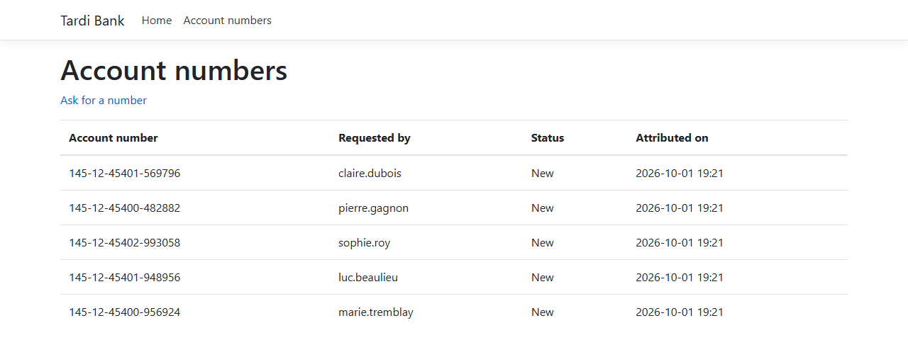
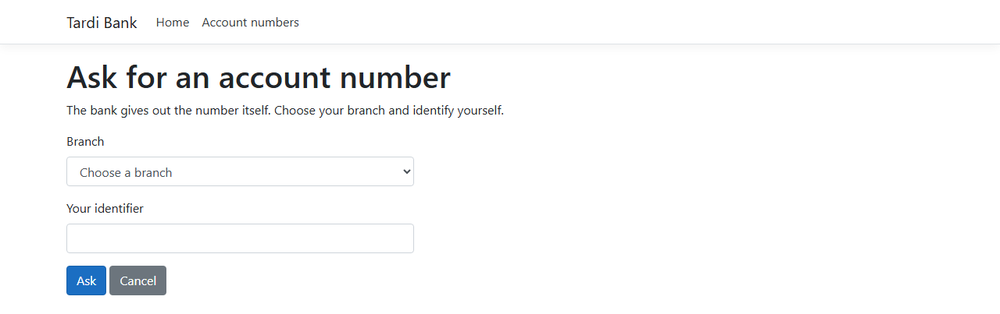
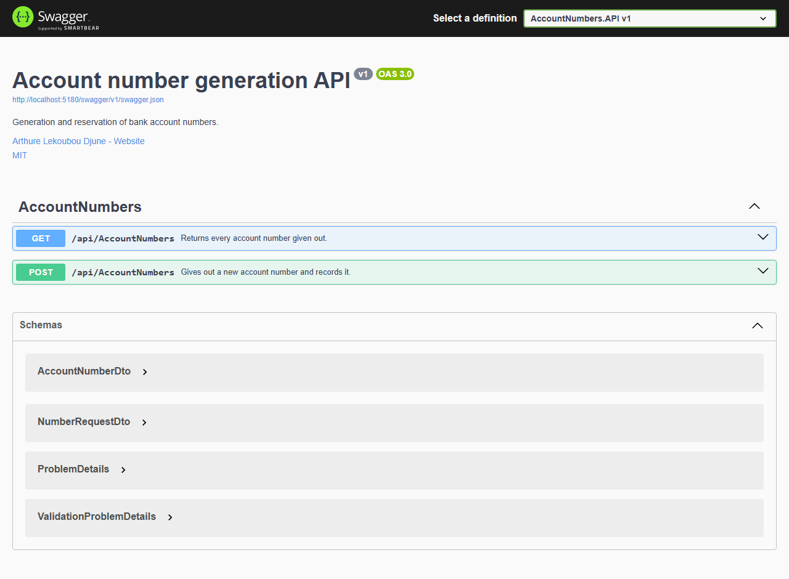

# bank-account-numbers

[](https://github.com/Arthure-code/bank-account-numbers/actions/workflows/build.yml)
[](https://sonarcloud.io/summary/new_code?id=Arthure-code_bank-account-numbers)
[](https://sonarcloud.io/summary/new_code?id=Arthure-code_bank-account-numbers)
[](https://sonarcloud.io/summary/new_code?id=Arthure-code_bank-account-numbers)
[](https://sonarcloud.io/summary/new_code?id=Arthure-code_bank-account-numbers)
[](https://sonarcloud.io/summary/new_code?id=Arthure-code_bank-account-numbers)
[](https://sonarcloud.io/summary/new_code?id=Arthure-code_bank-account-numbers)
[](https://sonarcloud.io/summary/new_code?id=Arthure-code_bank-account-numbers)

A bank gives out its own account numbers. An **API** draws them, keeps them and refuses to give the same one twice. A **web application** holds the branch screens and never builds a number itself: it asks the API and shows what comes back.

ASP.NET Core 8, Entity Framework Core 8, SQLite, Swagger.

## Screenshots

**The numbers given out**



**Asking for a number**



**The API**



## How it works

**The number is the bank's to give, never typed.** Sixteen digits in four slices, `145-12-45400-232054`: the bank, the system that asked, the branch, the account. The form carries two of them, the branch and who is asking. The other two are not the employee's business: the bank number is read from the API configuration, the calling system from the web application's own, so the day either changes, nothing is recompiled.

**The last two digits always form an even number.** Which comes down to drawing the last digit among 0, 2, 4, 6 and 8, rather than drawing six digits and throwing away half of them.

**The same number is never given twice.** The service draws against the numbers already attributed and tries again on a collision, fifty times at most, then answers that nothing was attributed rather than spinning. The database does not take the service's word for it either: a unique index on the number refuses the duplicate on its own.

**A malformed request never reaches the service.** Two digits for the calling system, five for the branch, an identifier that is not blank. The API turns what fails into a 400 before anything is drawn, and the service checks the same three rules again, because it is also called from elsewhere.

**Only the numbers nobody has used yet are listed.** A file is created with the status `Nouveau`, and the list shows those, most recent first. A number that has been put to use leaves the screen without leaving the database.

**The web application sees DTOs, never entities.** The API answers with the four fields the screens need, so the shape of the table stays the API's own business.

**Fifty-one tests, at four levels.** The controllers alone with their dependencies mocked, the service and the generic repository against a real SQLite database, one per test, the whole API answering its own addresses, and the whole web application answering its own pages with the API mocked. A hundred requests in a row give a hundred different numbers, and a rigged draw proves the collision is handled rather than hoped away.

## Running it

The API creates the SQLite file and migrates it on its first run, so start it first.

```bash
cd src/AccountNumbers.API
dotnet run
```

Then, in a second terminal, the web application:

```bash
cd src/AccountNumbers.Web
dotnet run
```

The API listens on `http://localhost:5180`, which is the address the web application reads from its configuration, and its Swagger page is at `/swagger`. The screens are at `http://localhost:5190/AccountNumbers`. Delete `AccountNumbers.db` to start over.

```bash
dotnet test AccountNumbers.sln
```

## Résumé

Générateur de numéros de compte bancaire en ASP.NET Core 8, en deux applications. Une API en trois couches tire les numéros et les conserve, une application MVC porte les écrans des branches et ne fabrique jamais un numéro elle-même : elle le request à l'API. Un numéro fait seize chiffres en quatre slices, bank, système appelant, branch et compte, et ses deux derniers chiffres forment toujours un nombre pair. L'employé ne saisit que la branch et son identifier ; le numéro de la bank vient de la configuration de l'API, celui du système appelant de la configuration de l'application. Le même numéro n'est jamais attribué deux fois : le service tire contre ceux qui sont déjà taken, recommence au plus cinquante fois, et un index unique en base refuse le doublon sans compter sur le service. Une request hors format est refusée avant d'atteindre le service, et seuls les numéros encore neufs paraissent à l'écran, du plus récent au plus previous. Cinquante et un tests couvrent les quatre niveaux, contrôleurs moqués, service et dépôt sur une vraie base SQLite, API entière de bout en bout, et application web entière avec l'API moquée.

## Licence

MIT. See [LICENSE](LICENSE).
